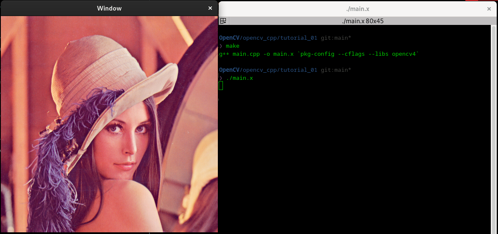
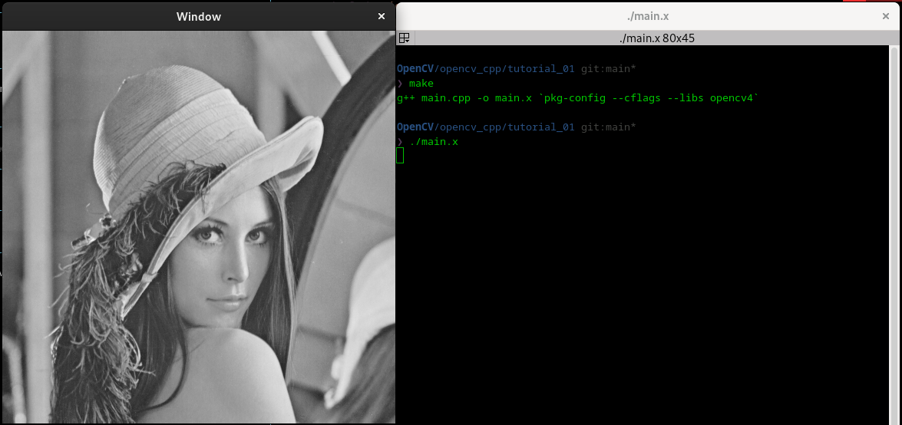
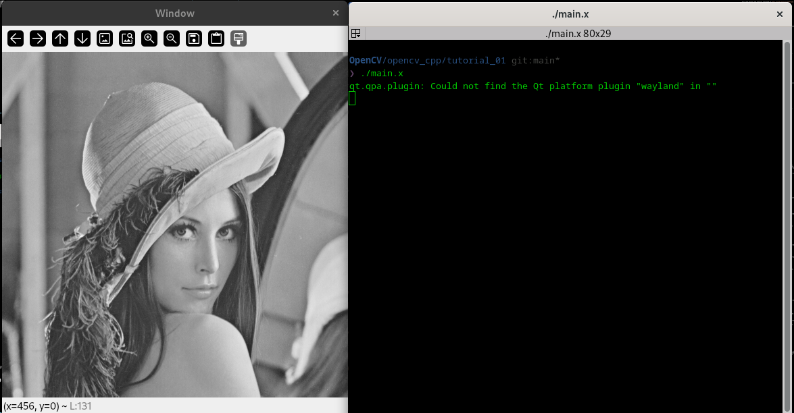
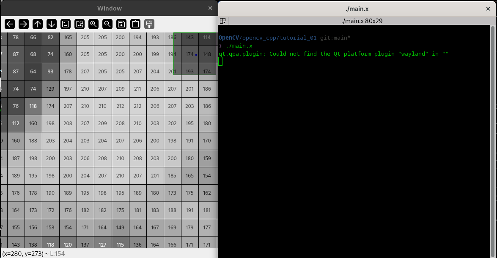
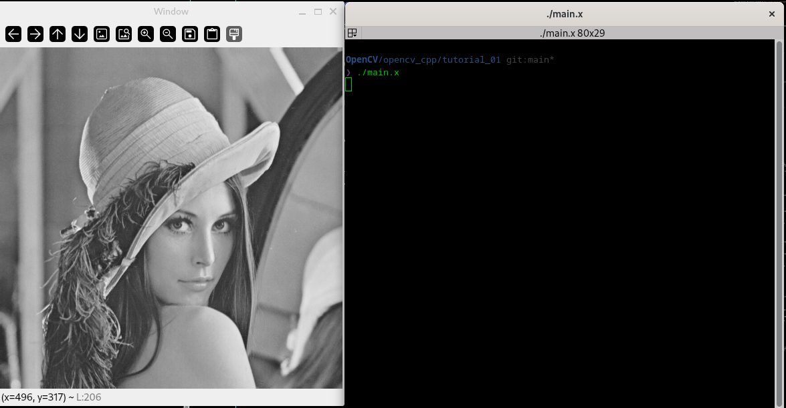
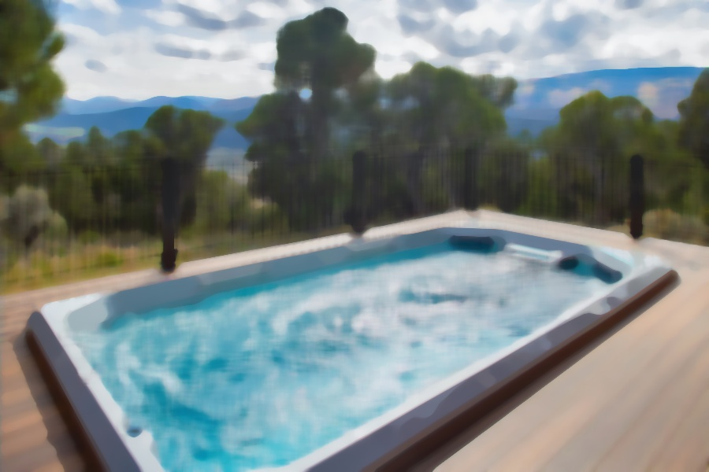

# OpenCV & C++

This code follows the tutorial presented at [this youtube playlist tutorial](https://youtube.com/playlist?list=PLUTbi0GOQwghR9db9p6yHqwvzc989q_mu&si=IQo60Ht2uCPmS9Gj).

## Tutorial 00: Instalation
### Installing from source

To install from source let's go through the following steps
```bash
sudo apt update && sudo apt upgrade
```

Now we clone the OpenCV source code repository by running the following command:
```bash
git clone https://github.com/opencv/opencv.git
```

Create a build directory and navigate to it by running the following commands:
```bash
cd opencv
mkdir build
cd build
```

Configure the build by running the following command:
```bash
cmake -D CMAKE_BUILT_TYPE=Release \
      -D CMAKE_INSTALL_PREFIX=/usr/local \
      -D OPENCV_GENERATE_PKGCONFIG=ON ..
```

Build and install OpenCV by running the following commands:
```bash
make -j8
sudo make install
```

Verify that OpenCV is installed correctly by running the following command,
```bash
pkg-config --modversion opencv4
```
the output must be something like:
```PlainText
4.13.0
```

### Addig library to source path

To add the library to source path permanetly, we need to execute,
```bash
echo "/usr/local/lib/" | sudo tee /etc/ld.so.conf.d/opencv.conf
sudo ldconfig
```
and to visualize if this have been successfull, we execute,
```bash
ldconfig -p | grep opencv
```
this generates the output
```PlainText
libopencv_videoio.so.413 (libc6,x86-64) => /usr/local/lib/libopencv_videoio.so.413
libopencv_videoio.so (libc6,x86-64) => /usr/local/lib/libopencv_videoio.so
...
```

### Testing Installation

Let's make a short program to test the installation of the libray.
```cpp
#include <iostream>
#include <opencv2/opencv.hpp>

int main() {
    cv::Mat img(200, 200, CV_8UC3, cv::Scalar(0,255,0));
    if(img.empty()) {
        std::cerr << "Error: OpenCV not working!" << std::endl;
        return -1;
    }
    std::cout << "OpenCV is working! Version: " << CV_VERSION << std::endl;
    return 0;
}
```

Let's compile it and execute it
```bash
g++ main.cpp -o main.x `pkg-config --cflags --libs opencv4`
./main.x
```
which output must be,
```PlainText
OpenCV is working! Version: 4.13.0-dev
```

## Tutorial 01: imread, imshow & waitKey    

In this tutorial let's use the OpenCV functionalities to load, and show images, namely, let's use the functions `imshow`, `imread` and `waitKey`.
```cpp
#include <iostream>
#include <opencv2/highgui.hpp>

int main()
{
    // LOAD LENNA IMAGE
    cv::Mat img = cv::imread("./Lenna.png");

    // SHOW LENNA IMAGE
    cv::imshow("Window", img);
    cv::waitKey(0);

    return 0;
}
```

Now, when we compile and execute this code, we get:
```bash
g++ main.cpp -o main.x `pkg-config --cflags --libs opencv4`
./main.x
```
```PlainText
cv2.error: OpenCV(4.13.0) error: (-2:Unspecified error) The function is not implemented. Rebuild the library with Windows, GTK+ 2.x or Cocoa support. If you are on Ubuntu or Debian, install libgtk2.0-dev and pkg-config, then re-run cmake or configure script in function ‘cvShowImage’
```

Here we get an error due to there is no GUI to plot the pictures, like GTK or Qt. Let's try to install libgtk2.0-dev and pkg-config as suggest the error message.
```bash
sudo apt install pkg-config libgtk2.0-dev -y
```

The installation of `pkg-config` is successful, however it could fail the instalation of `libgtk2.0-dev`, showing a similar error message as:
```
E: Failed to fetch http://deb.debian.org/debian/pool/main/l/linux/linux-libc-dev_5.10.70-1_amd64.deb  404  Not Found [IP: 199.232.22.132 80]
E: Unable to fetch some archives, maybe run apt-get update or try with --fix-missing?

```

This is due to Debian (in this case) does not contain the necessary repositories to install this library. In this case, let's change the official repositories
```python
# # Oficial contrib Repos

deb http://deb.debian.org/debian bookworm main contrib non-free non-free-firmware
deb-src http://deb.debian.org/debian bookworm main contrib non-free non-free-firmware

# # Security Updates

deb http://security.debian.org/debian-security bookworm-security main contrib non-free non-free-firmware
deb-src http://security.debian.org/debian-security bookworm-security main contrib non-free non-free-firmware

# # Bookworm Updates

deb http://deb.debian.org/debian bookworm-updates main contrib non-free non-free-firmware
deb-src http://deb.debian.org/debian bookworm-updates main contrib non-free non-free-firmware
```
by some repositories which are mirror from US repositories, namely,
```python
# # Oficial contrib Repos

deb http://ftp.us.debian.org/debian bookworm main contrib non-free non-free-firmware
deb-src http://ftp.us.debian.org/debian bookworm main contrib non-free non-free-firmware

# # Security Updates

deb http://security.debian.org/debian-security bookworm-security main contrib non-free non-free-firmware
deb-src http://security.debian.org/debian-security bookworm-security main contrib non-free non-free-firmware

# # Bookworm Updates

deb http://ftp.us.debian.org/debian bookworm-updates main contrib non-free non-free-firmware
deb-src http://ftp.us.debian.org/debian bookworm-updates main contrib non-free non-free-firmware
```

Let's update our system, and try to install the library.
```bash
sudo apt update
sudo apt install libgtk2.0-dev
```
In this case the installation was successful. Now as the error message said, we need to rebuild the library.
```bash
sudo make uninstall

cmake -D CMAKE_BUILT_TYPE=Release \
      -D CMAKE_INSTALL_PREFIX=/usr/local \
      -D OPENCV_GENERATE_PKGCONFIG=ON ..

make -j8
sudo make install
```

> **! WARNING**
> Remember to come back to the original Debian repositories after this installation.


Finaly, let's compile and execute our original code once more time.
```bash
g++ main.cpp -o main.x `pkg-config --cflags --libs opencv4`
./main.x
```
In this case this code must open the *Lenna* picture. However, it's appears a new error message related to GTK package.
```PlainText
Gtk-Message: Failed to load module "canberra-gtk-module"
```

This error has easy solution, just let's install that module
```bash
sudo apt install libcanberra-gtk-module
```
And at this time the error have been fixed and the *Lenna* picture is showed up once again.



Moreover, OpenCV offers the options to load images on different colors scales via the `imread flag`. The valid colors are contained in this table [ImreadModes](https://docs.opencv.org/3.4/d8/d6a/group__imgcodecs__flags.html#ga61d9b0126a3e57d9277ac48327799c80). Then, if we choose the gray scale, for instance, we would get
```cpp
#include <iostream>
#include <opencv2/highgui.hpp>

int main()
{
    // LOAD LENNA IMAGE
    cv::Mat img = cv::imread("./Lenna.png", cv::IMREAD_GRAYSCALE);

    // SHOW LENNA IMAGE
    cv::imshow("Window", img);
    cv::waitKey(0);

    return 0;
}
```


In this case we see that the image app has no options to zoom in or out, or to mode the image, this is because the building of the library did not take into account the **Qt** option to show pictures. Then, let's install **Qt6** and rebuild the library.

```bash
sudo apt install qt6-base-dev -y
```
```bash
cd .../build
sudo make uninstall

cmake -D CMAKE_BUILT_TYPE=Release \
-D CMAKE_INSTALL_PREFIX=/usr/local \
-D OPENCV_GENERATE_PKGCONFIG=ON \
-D WITH_QT=ON ..

make -j8
sudo make install
```

Now, when we execute the main code, we get:




The message appearing in the terminal output, it has easy solution it is just necessary to install `qt6-wayland`,
```bash
sudo apt install qt6-wayland -y
```

Executing once again the main code,



## Tutorial 02: bilateralFilter, GaussianBlur, medianBlur

In this tutorial let's apply some filter on images and discuss the properties of the following filters. [Image Filtering OpenCV](https://docs.opencv.org/4.3.0/d4/d86/group__imgproc__filter.html)

```cpp
#include <opencv2/highgui.hpp>
#include <opencv2/imgproc.hpp>

int main()
{
    cv::Mat img = cv::imread("./pool.jpg", cv::IMREAD_COLOR);

    // PROCESSING IMAGE
    cv::Mat bilateralImg, gaussianImg, medianImg;

    cv::bilateralFilter(img, bilateralImg, 15, 95, 45);
    cv::GaussianBlur(img, gaussianImg, cv::Size(15,15), 0);
    cv::medianBlur(img, medianImg, 15);

    // SAVE IMAGE
    cv::imwrite("./../images/tutorial_02/00.jpg", img);
    cv::imwrite("./../images/tutorial_02/01.jpg", bilateralImg);
    cv::imwrite("./../images/tutorial_02/02.jpg", gaussianImg);
    cv::imwrite("./../images/tutorial_02/03.jpg", medianImg);

    // PLOTTING
    cv::imshow("Input Image", img);
    cv::imshow("Bilateral Filter", bilateralImg);
    cv::imshow("Gaussian Filter", gaussianImg);
    cv::imshow("Median Filter", medianImg);
    cv::waitKey(0);

    return 0;
}
```

This code load the image of a pool, then apply on this image 3 kind of filters, a bilaterial, gaussian and median filter. Let's see its results:

<table style="border-collapse: collapse; border: none;">
  <tr>
    <td align="center" style="border: none;">
      <br>
      <p><b>Image 1:</b> Input Image </p>
    </td>
    <td align="center" style="border: none;">
      <br>
      <p><b>Image 2:</b> Bilateral Filter </p>
    </td>
  </tr>
  <tr>
    <td align="center" style="border: none;">
      <br>
      <p><b>Image 3:</b> Gaussian Filter</p>
    </td>
    <td align="center" style="border: none;">
      <br>
      <p><b>Image 4:</b> Median Filter</p>
    </td>
  </tr>
</table>

From these images we can conclude:

1. Among these filters, the bilateral filter is the best preserving edges and smoothing the inner zones.
2. The median filter  makes no distinction between egdes or zones, just smooth image according to its kernel size.
3. These 3 filters have the capability of removing background noise.